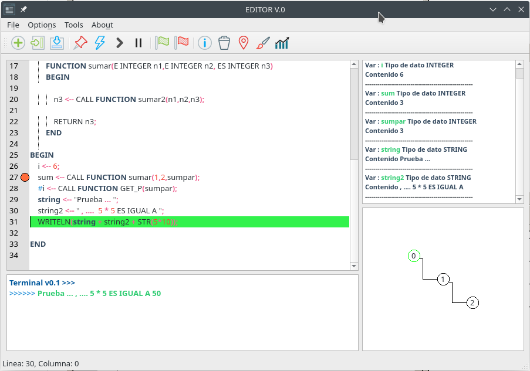
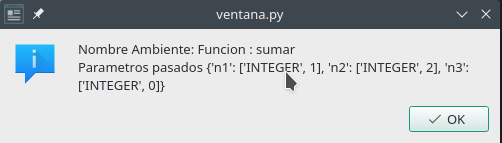
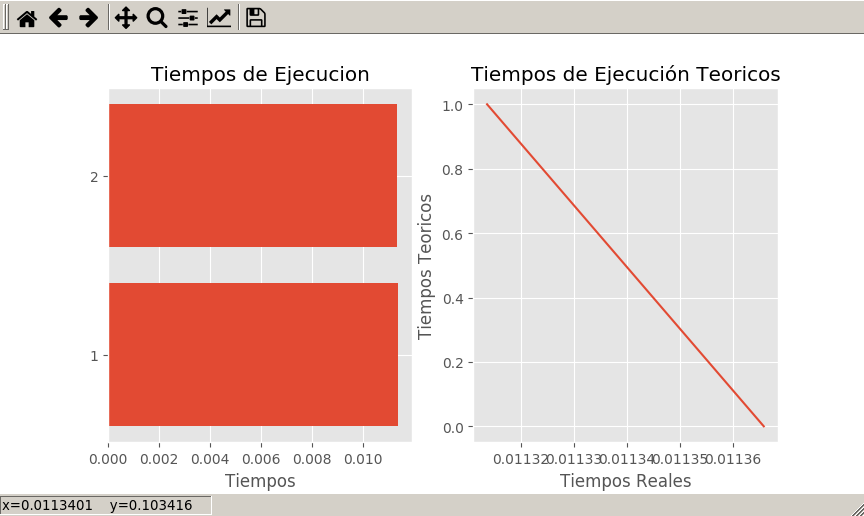

# CodeCost
This is a project with the purpose of facilitate the analysis of iterative algorithms for a user.

> :warning: This project was created in the year 2016-2 with educational/study purposes only. 

## Features
This project has the following features:
- It has his own language syntax, similar to psudocode and pascal (It's build using python and [ply library](https://github.com/dabeaz/ply)).
- It allows the user to create and execute code in the language's own code editor.
- It allows the user to execute the code step by step (Like a debbuger).
- It allows the user to see the generated execution tree and see what happens in each node.
- It allows the user to create breakpoints and see what happens at this point in the execution.

## Tools used
To build this project we use:
- PLY (Python  Lex-Yacc) http://www.dabeaz.com/ply/ 
- PyQt5 https://pypi.org/project/PyQt5/
- Qscintilla https://pypi.org/project/QScintilla/
- Matplotlib http://matplotlib.org 


> :information_source: This project was testes on Linux (Manjaro, Fedora, Ubuntu y OpenSuse specifically), but it has an acceptable performance in Windows 10.

### Preview

Code editor and breakpoints.



Node info in code execution tree.



Execution times graphic.



## Run project
### Virtualenv
```bash
# Creating environment
virtualenv .
# Installing dependencies
pip install -r requirements.txt
# Running app
python main.py
```

### Docker
#### Build image (Experimental)

```
docker build -t project/pyqt5 .
```

#### Run image (Experimental)
**Nota:** This command only works on Unix operating systems or those that use X11.

Execute in the host OS

```bash
xhost local:root
```

Execute the docker image

```
docker run -it \
    -v /tmp/.X11-unix:/tmp/.X11-unix \
    -v $(pwd):/app \
    -e DISPLAY=$DISPLAY \
    project/pyqt5 python /app/ventana.py
```
